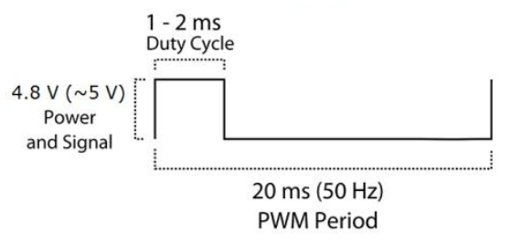

# Protocolo de comunicação
são enviados pacotes de 3 números via I2C para a ESP32 onde o primeiro é sempre um comando e o segundo e o terceiro são baseados no comando:
**\<COMMAND\> \<PARAM1\> \<PARAM2\>**
## Comandos:
### 0: set angle
_PARAM1_: ID do servo que vai se movimentar
- IDs desconhecidos serão simplesmente ignorados

_PARAM2_: angulo que o servo deve assumir
- limitado entre 0 e 180
### 1: set min pulse width
_PARAM1_: ID do servo que vai se movimentar
- IDs desconhecidos serão simplesmente ignorados

_PARAM2_: tempo minimo do pulso em $\mu s$, representa o angulo 0
- deve ser na ordem de grandeza de $500\mu s$

### 2: set max pulse width
_PARAM1_: ID do servo que vai se movimentar
- IDs desconhecidos serão simplesmente ignorados

_PARAM2_: tempo minimo do pulso em $\mu s$, representa o angulo 180
- deve ser na ordem de grandeza de $2500\mu s$
### 3: set centroid
_PARAM1_: coordenada X do centroide

_PARAM2_: coordenada Y do centroide
### 4: set controller parameters
_PARAM1_: qual parâmetro de ganho está sendo enviado (serve para o calculo dos coeficientes do controlador)
- 0: P
- 1: I
- 2: D
- 3: Step gain
- 4: Reset buffers

_PARAM2_: valor do parâmetro de ganho
### 5: set aim mode
_PARAM1_: define o modo da mira
- 0: mira manual
- 1: mira automatica
- 2: override mira automatica e manual ao mesmo tempo
